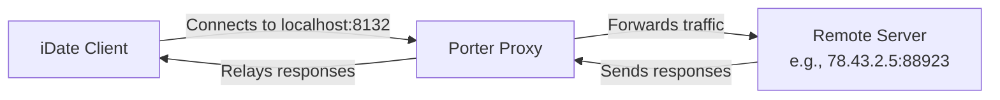

# Porter
A lightweight TCP proxy that enables game clients (like iDate) to connect to custom server ports without binary patching.

## Overview

Porter is a simple TCP proxy written in Rust, designed to solve the problem of hardcoded ports in game clients. The iDate game client, for example, always connects to port `8132`. With Porter, you can run a local proxy that listens on `127.0.0.1:8132` (or any other address) and forwards traffic to a remote server with a different port, making it easy to switch between servers without requiring administrative privileges or modifying the game binary.

## Features

- **Zero‑configuration**: Defaults to listening on `127.0.0.1:8132` – the exact port the iDate client expects.
- **No admin rights**: Runs as a regular user; no need to open privileged ports.
- **Lightweight**: Built with Tokio for high‑performance, asynchronous I/O.
- **Easy to use**: Single binary, command‑line driven.
- **Cross‑platform**: Works on Windows, macOS, and Linux.

## Installation

### From source (requires Rust)

```bash
cargo install --path .
```

### Download pre‑built binary

Check the [Releases](https://github.com/ultimatuuuum/porter/releases) page for pre‑compiled binaries.

## Usage

Run Porter with one or two arguments: the remote server address (required) and an optional local address to listen on. If only one argument is provided, Porter listens on `127.0.0.1:8132` by default.

```bash
porter [LISTEN_ADDR] REMOTE_ADDR
```

- `LISTEN_ADDR` (optional) – local interface and port (default: `127.0.0.1:8132`)
- `REMOTE_ADDR` (required) – remote server address, e.g., `78.43.2.5:88923`

### Examples

**Proxy iDate traffic to a server on port 88923:**

```bash
porter 78.43.2.5:88923
```
(Since the first argument is omitted, Porter listens on `127.0.0.1:8132`.)

**Listen on a different local port (e.g., 9000) and forward to a remote server:**

```bash
porter 127.0.0.1:9000 78.43.2.5:88923
```

**Listen on all interfaces:**

```bash
porter 0.0.0.0:8132 78.43.2.5:88923
```

## How It Works

Porter creates a TCP listener on the specified local address. Whenever a client (like the iDate game) connects to that listener, Porter establishes a separate TCP connection to the remote server and then bidirectionally copies data between the two sockets. This transparent forwarding allows the client to communicate with the remote server as if it were talking directly to the hardcoded port.

### Architecture Diagram



## Configuration

No configuration files are needed. All settings are passed as command‑line arguments.

## Building from Source

1. Ensure you have Rust and Cargo installed (version 1.70 or later).
2. Clone the repository:
   ```bash
   git clone https://github.com/ultimatuuuum/porter.git
   cd porter
   ```
3. Build the release binary:
   ```bash
   cargo build --release
   ```
   The binary will be placed at `target/release/porter`.

## License

This project is licensed under the MIT License – see the [LICENSE](LICENSE) file for details.

## Contributing

Contributions are welcome! Please open an issue or submit a pull request on GitHub.

## Acknowledgments

- Built with [Tokio](https://tokio.rs/) for async networking.
- Inspired by the need to work around hardcoded ports in game clients.